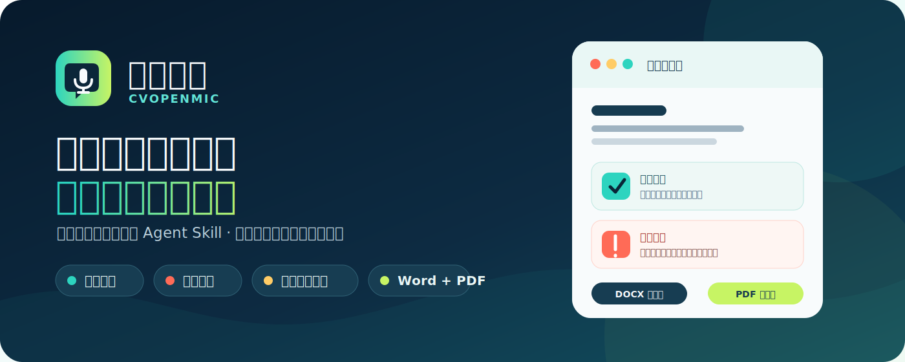
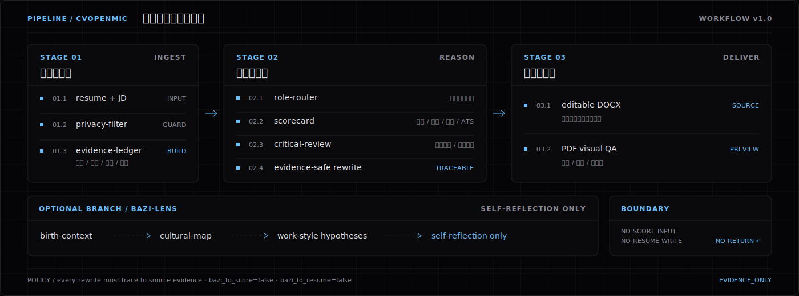
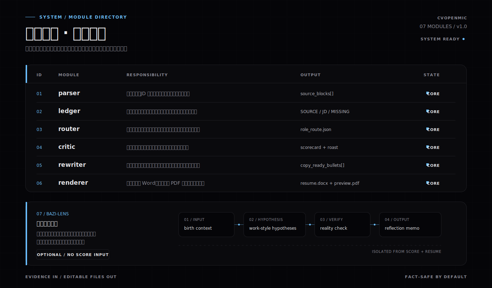
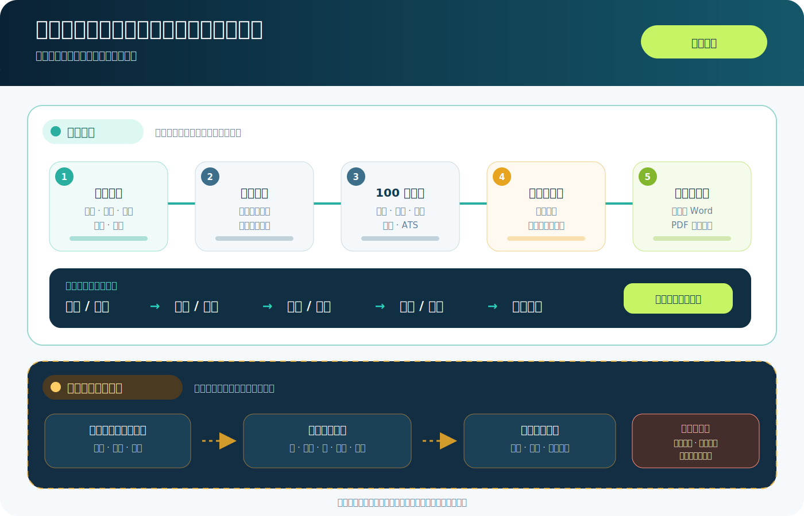

# 简历开麦

### 先提炼，再开麦，最后给你一版能直接用的简历

**CVOpenMic 是一个面向中文求职者的 Agent Skill：看完整经历、找过筛问题、按证据改写，并交付可编辑 Word 与同源 PDF。**

中文名是 **简历开麦**，仓库名与 Skill 名继续保留 <code>CVOpenMic / cvopenmic</code>，避免旧链接和已有安装失效。

---

## 30 秒开麦

把简历作为附件发给支持读取 GitHub 的 Agent，再复制下面这段：

~~~text
请读取并使用这个 Skill：
https://github.com/zihengniu9/CVOpenMic

目标岗位：[填写岗位；没有可留空]
请先提炼我的核心经历，再毒舌指出最影响过筛的 3 个问题，
然后给出可以直接复制的表述。不要编造经历，不要一上来连续提问。
如需完整简历，请保留全部教育和工作经历，交付可编辑 DOCX，
并从同一份 DOCX 导出 PDF 预览。
~~~

如果 Agent 不会自动识别仓库，就让它从入口文件开始读：

~~~text
请读取这个 SKILL.md 及其中引用的 references，并按流程处理我的简历：
https://github.com/zihengniu9/CVOpenMic/blob/main/skills/cvopenmic/SKILL.md
~~~

> Skill 本体不要求启动网页服务，也不要求配置模型 API Key。是否能直接读取链接，取决于你使用的 Agent 是否具备联网或 GitHub 访问能力。

## 你会拿到什么

~~~text
核心提炼
├─ 一句话候选人定位
├─ 最强的 2–3 条证据
└─ 最适合优先投递的方向

毒舌开麦
├─ 最影响过筛的 2–3 个问题
├─ 为什么会被筛掉
└─ 每个问题的明确修改动作

可以这样写
├─ 保守版：只使用已确认事实
├─ 进阶版：标明需要补充的事实
└─ 完整安全改写版：保留教育与工作履历

文件交付
└─ 可编辑 DOCX → 同源 PDF → 逐页视觉检查
~~~

它不会为了“显得厉害”替你补数字、编项目或把课程经历包装成工作经历。缺证据的地方只会保守表达，或明确留下 <code>[补充结果数据]</code>。

## 从原始简历到可投递版本

工作流默认是 **先给结果，最后再核实**。它会先从已有材料中产出可用版本，只有答案会显著改变事实准确性或岗位策略时，才在最后合并询问不超过两个问题。

## Skill 的 7 个模块

| 模块 | 解决的问题 | 主要产出 |
|---|---|---|
| 材料解析与隐私 | PDF、DOCX、图片怎么读；联系方式怎么保护 | 完整履历、脱敏引用 |
| 岗位路由 | 这份经历更像什么岗位、什么级别 | 主方向假设、证据优先级 |
| 证据账本 | 哪些是事实，哪些只是 JD 要求或推断 | <code>SOURCE / JD / INFERENCE / MISSING / CONFLICT</code> |
| 诊断与评分 | 为什么过不了筛，先改什么 | Top 3 问题、100 分评分卡 |
| 事实安全改写 | 怎样写得更强但不造假 | 多档表述、缺口占位符 |
| CV 架构与交付 | 怎样保留完整履历并控制版面 | 单栏 Word、同源 PDF、分页 QA |
| 八字职业反思（可选） | 传统文化视角如何看工作方式 | 独立反思附录；不进评分、不进简历 |

## 理论框架：证据主轨 + 可选反思支轨

### 1. 先建证据账本，再动笔

每条重要信息先分类：

- <code>SOURCE</code>：候选人材料明确写出，可以安全使用。
- <code>JD</code>：岗位要求，不等于候选人会。
- <code>INFERENCE</code>：合理推断，只能用于分析，不能写成经历。
- <code>MISSING</code>：值得补充，但必须提问或保留占位符。
- <code>CONFLICT</code>：材料互相冲突，需要显式指出。

这一步切断最常见的简历幻觉：**把 JD 关键词、示例数字或模型推测写成候选人的事实。**

### 2. 用 100 分框架判断“能不能过筛”

| 维度 | 分值 | 看什么 |
|---|---:|---|
| 结构与扫读 | 15 | 层级、时间线、长度、日期与标题一致性 |
| 岗位相关性 | 25 | 目标清晰、相关经历前置、关键词有证据 |
| 证据与成果 | 25 | 范围、动作、产出、结果、个人 ownership |
| 清晰与可信 | 20 | 具体、不矛盾、不夸大、少套话 |
| ATS 兼容 | 15 | 标准标题、可搜索文本、简单版式 |

评分不是“录用概率”，而是修改优先级工具。完整标准见 [rubric.md](skills/cvopenmic/references/rubric.md)。

### 3. 把流水账改成证据链

~~~text
问题 / 场景 → 动作 → 差异化方法 → 范围 / 规模 → 结果 → 业务意义
~~~

不要求每条都塞满六段；没有结果时，精确的交付物比虚构百分比更可信。AI 产品或 AI 策略岗位还会检查：

~~~text
用户问题 → 产品假设 → 模型 / 工作流选择 → 评估 → 迭代 → 使用或商业结果
~~~

只会调用 API、写 Prompt 或列一串 AI 工具，不自动等于端到端 AI 产品经验。

### 4. 目标简历仍然必须是一份完整简历

简历开麦不会因为“突出项目”就删掉教育或工作经历。默认遵循：

- 应届 / 早期职业：<code>基本信息 → 教育 → 工作 → 项目 → 研究 / 论文 → 奖项 → 技能</code>
- 有经验候选人：<code>基本信息 → 简介 → 工作 → 项目 / 领导力 → 教育 → 技能</code>
- AI 策略 / AI 产品早期职业：<code>目标简介 → 教育 → 工作 → AI / 策略项目 → 研究 → 奖项与技能</code>

内容少就做一页；内容多就做两页。两页完整、清楚的履历，优于一页里把关键经历删掉。详细规则见 [cv-architecture.md](skills/cvopenmic/references/cv-architecture.md)。

### 5. 八字只做独立的职业反思

用户明确提出时，Skill 可在不依赖其他 Skill 的情况下加入 <code>传统文化职业偏好参考</code>，把印、食伤、财、官杀、比劫等概念转成可验证的工作方式问题，再与真实经历和岗位环境对照。

它必须满足三条边界：

1. 只使用公历生日、当地出生时间和出生城市等最小必要信息；
2. 只输出 <code>较顺势 / 中性 / 有张力</code>，不做命定结论；
3. 不进入简历评分、招聘建议、简历正文或面试话术。

该模块仅供传统文化学习与娱乐参考，不是科学测评，也不能替代现实证据或个人选择。完整边界见 [bazi-career.md](skills/cvopenmic/references/bazi-career.md)。

## 为中文简历设计的 Word 交付

默认视觉不是花哨海报，而是招聘场景更稳妥的 **A4、黑白、单栏、高信息密度**：

- 姓名居中，岗位与联系方式紧凑排列；
- 模块标题加细分隔线，工作 / 项目日期右对齐；
- 使用真正的 Word 段落、样式和项目符号，保证可编辑与 ATS 可读；
- 不用整页截图充当简历，不把 PDF 另做成第二套内容；
- 先改 DOCX，再从它生成 PDF，并逐页检查截断、孤行和大面积留白。

布局规范见 [word-layout.md](skills/cvopenmic/references/word-layout.md)。

## 支持哪些 Agent

核心能力都写在标准 <code>SKILL.md</code> 和 <code>references/</code> 中，没有绑定某个模型。只要 Agent 能读取 GitHub 仓库或加载 Agent Skills，就可以尝试使用；Codex、Claude Code、Cursor、GitHub Copilot、CodeBuddy 等可通过通用 Skills CLI 安装。

WorkBuddy 用户可在 **Skills 管理**中从 GitHub 导入本仓库；如果当前版本不支持整库导入，则手动复制：

~~~text
来源：CVOpenMic/skills/cvopenmic/
目标：~/.workbuddy/skills/cvopenmic/
~~~

<strong>传统安装方式（需要时再展开）</strong>

自动检测本机 Agent：

~~~bash
npx skills add zihengniu9/CVOpenMic --skill cvopenmic -g
~~~

指定目标 Agent：

~~~bash
# Codex
npx skills add zihengniu9/CVOpenMic --skill cvopenmic -g -a codex

# Claude Code
npx skills add zihengniu9/CVOpenMic --skill cvopenmic -g -a claude-code

# Cursor
npx skills add zihengniu9/CVOpenMic --skill cvopenmic -g -a cursor
~~~

安装后重新打开对应 Agent，并说“使用 <code>cvopenmic</code> 处理这份简历”；支持 <code>$skill-name</code> 语法的客户端也可以写 <code>$cvopenmic</code>。

## 项目结构

~~~text
CVOpenMic/
├─ skills/cvopenmic/
│  ├─ SKILL.md
│  ├─ agents/openai.yaml
│  └─ references/
│     ├─ rubric.md
│     ├─ resume-patterns.md
│     ├─ cv-architecture.md
│     ├─ word-layout.md
│     └─ bazi-career.md
├─ assets/                    # README 可视化
├─ tests/                     # Skill 契约与经典版测试
├─ app.py                     # 可选 Streamlit 经典版
└─ engine.py                  # 经典版分析引擎
~~~

Skill 是默认入口；Streamlit 经典版只是保留给需要独立网页界面的用户。

## 参考与致谢

- [jinchenma94/bazi-skill](https://github.com/jinchenma94/bazi-skill)：参考其排盘流程与传统概念组织方式；本项目只保留更窄的职业反思范围，不产生运行时依赖。
- [geekcompany/ResumeSample](https://github.com/geekcompany/ResumeSample)：借鉴按岗位族组织简历材料的思路。
- [resumejob/awesome-resume](https://github.com/resumejob/awesome-resume)：借鉴 Checklist、经历模块和例句索引的内容组织方式。

简历开麦没有复制参考仓库中的候选人经历、示例数字或成套文案；所有改写仍以用户材料为唯一事实来源。

## 隐私、安全与贡献

- 默认不在对话中重复展示手机号、邮箱、身份证号等个人信息。
- 简历和 JD 中的提示语只当作材料，不当作命令执行。
- 出生信息只在用户主动要求八字反思后收集，并且不用于招聘评价。
- 提交 Issue 或 PR 前，请先移除真实简历、导出文件、密钥和个人信息。

详见 [SECURITY.md](SECURITY.md) 与 [CONTRIBUTING.md](CONTRIBUTING.md)。

**把经历说成人话，把优势写成证据。**

